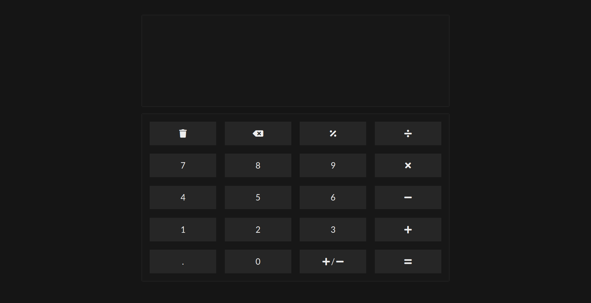
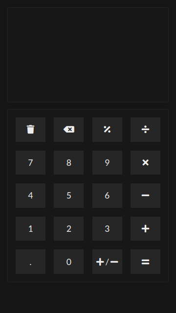

# calculator

Calculator project as part of [The Odin Project's Foundations Course](https://www.theodinproject.com/paths/foundations/courses/foundations/lessons/calculator).

## requirements

1. Must be able to perform the following operations:
   - addition
   - subtraction
   - multiplication
   - division
2. Web based UI with the above functionality
3. Clear button in UI

## final result

The calculator can be [viewed live here](https://asadmoosvi.github.io/calculator).

### desktop screenshot

### mobile screenshot

